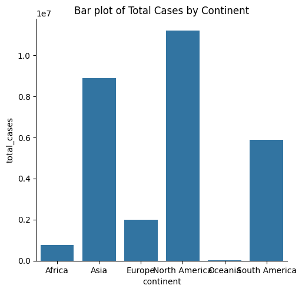

# 🦠 COVID-19 Data Analysis Project using Python

This project demonstrates an end-to-end analysis of COVID-19 data using Python. The data is sourced from [Our World in Data](https://github.com/SR1608/Datasets/blob/main/covid-data.csv) and explores various insights including continent-level aggregation, correlation, and visual analytics.

---

## 📥 1. Importing the Dataset

```python
import pandas as pd
url = "https://raw.githubusercontent.com/SR1608/Datasets/main/covid-data.csv"
df = pd.read_csv(url)
```

---

## 🧾 2. High-Level Data Understanding

```python
rows, columns = df.shape
print(f"Number of rows: {rows}")
print(f"Number of columns: {columns}")
print(df.dtypes)
print(df.info())
print(df.describe())
```

### 🔍 Output:
- **Rows:** 121,019
- **Columns:** 67
- Data types show a mix of float, object (string), and datetime types.

---

## 🔍 3. Low-Level Data Understanding

```python
df['location'].nunique()
df['continent'].value_counts()
df['total_cases'].max(), df['total_cases'].mean()
df['total_deaths'].quantile([0.25, 0.5, 0.75])
df.groupby('continent')['human_development_index'].max().idxmax()
df.groupby('continent')['gdp_per_capita'].min().idxmin()
```

### 🔍 Output & Analysis:
- **Unique Locations:** 216
- **Continent with most records:** Europe
- **Max Total Cases:** 55,154,651
- **Mean Total Cases:** 167,797
- **Total Deaths Quartiles:**
  - 25%: 13.0
  - 50%: 84.0
  - 75%: 727.0
- **Max HDI Continent:** Europe
- **Min GDP Per Capita Continent:** Africa

---

## 🧹 4. Data Cleaning

```python
df = df[['continent', 'location', 'date', 'total_cases', 'total_deaths', 'gdp_per_capita', 'human_development_index']]
df = df.drop_duplicates()
df = df.dropna(subset=['continent'])
df = df.fillna(0)
df['date'] = pd.to_datetime(df['date'])
df['month'] = df['date'].dt.month
```

Data was cleaned by removing null `continent` values, filling missing values with 0, and formatting the `date` column.

---

## 📊 5. Data Aggregation & Feature Engineering

```python
df_groupby = df.groupby('continent').max().reset_index()
df_groupby['total_deaths_to_total_cases'] = df_groupby['total_deaths'] / df_groupby['total_cases']
```

### ✅ New Feature:
- `total_deaths_to_total_cases` ratio to understand fatality impact by continent.

---

## 📈 6. Visualizations

### a. Univariate Analysis - GDP per Capita

```python
sns.histplot(df['gdp_per_capita'], kde=True)
```

> Shows highly right-skewed distribution. Most countries have a lower GDP, while a few outliers have significantly higher values.

---

### b. Scatter Plot - Total Cases vs GDP per Capita

```python
sns.scatterplot(x='total_cases', y='gdp_per_capita', data=df)
```

> No strong correlation; high GDP doesn't necessarily lead to higher/lower COVID case counts.

---

### c. Pairplot of Grouped Data

```python
sns.pairplot(df_groupby)
```

> Helps to identify patterns or clusters between key aggregated metrics across continents.

---

### d. Bar Plot - Total Cases by Continent

```python
sns.catplot(x='continent', y='total_cases', data=df_groupby, kind='bar')
```



> Asia and North America show the highest number of cases, while Africa and Oceania remain on the lower end.

---

## 📊 KMeans Clustering Visualization


> The 3D cluster visualization categorizes continents into similar COVID impact levels based on cases, deaths, GDP, and HDI:
- **Cluster 0:** Moderate metrics
- **Cluster 1:** High GDP, lower cases
- **Cluster 2:** High impact (cases and deaths)

---

## 💾 Exporting the Result

```python
df_groupby.to_csv('df_groupby.csv', index=False)
print("DataFrame saved to df_groupby.csv")
```

> Grouped summary data saved for future analysis or reporting.

---

## 🧰 Tools Used
- **Python**
- **Pandas & NumPy**
- **Matplotlib & Seaborn**
- **Plotly (interactive charts)**
- **Scikit-learn (clustering)**

---

## 📄 Dataset Source
- [Our World in Data – COVID-19](https://github.com/SR1608/Datasets/blob/main/covid-data.csv)

---

*Created with ❤️ by Kaustubh Narayankar during Internship at Vaishnav Technologies.*
